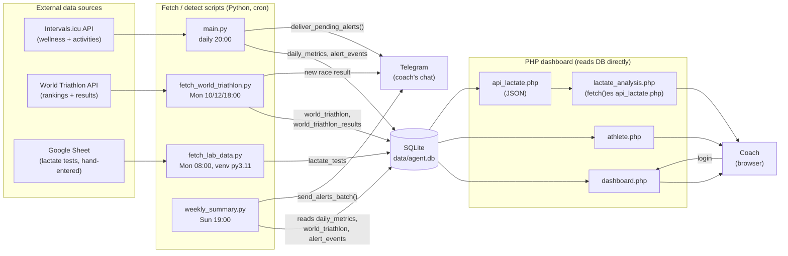
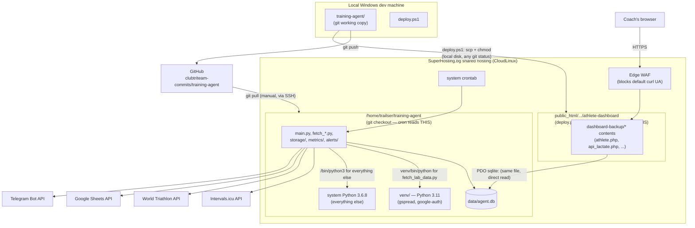
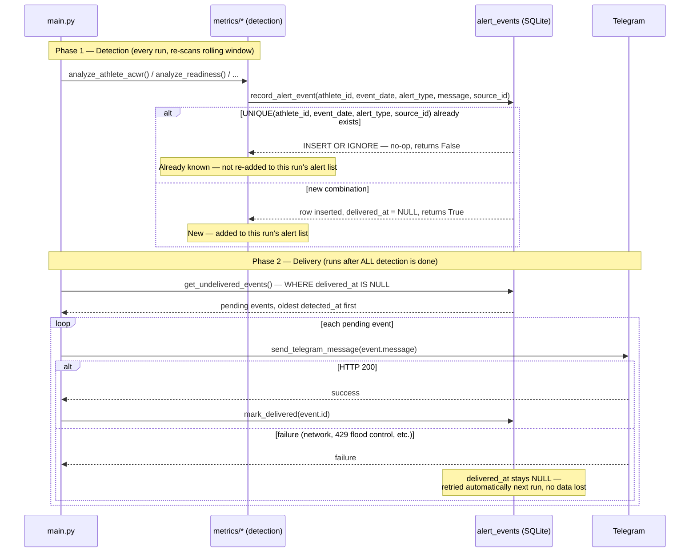

# Diagrams

## Резюме (Executive Summary)

Три диаграми: (1) откъде идват данните и как стигат до потребителя, (2) къде физически живее всяка част от системата (лаптоп, GitHub, сървър, външни услуги), и (3) какво се случва стъпка по стъпка от откриване на проблем до Telegram съобщение.

---

## 1. Data flow

## 2. Infrastructure

## 3. Alert lifecycle

